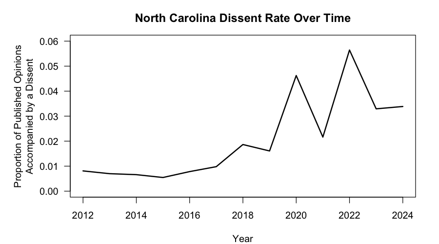
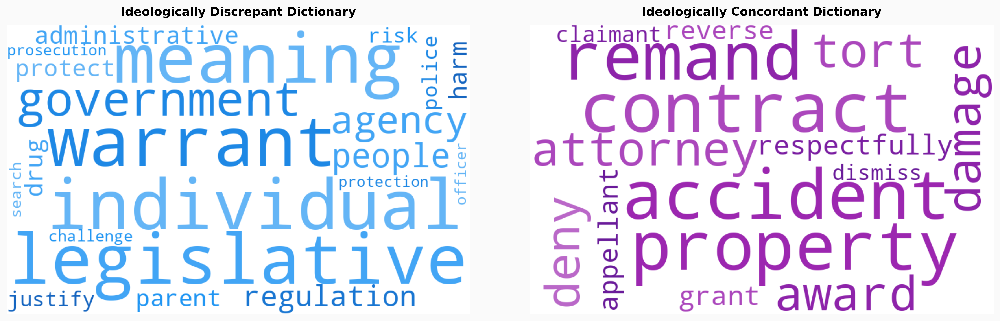
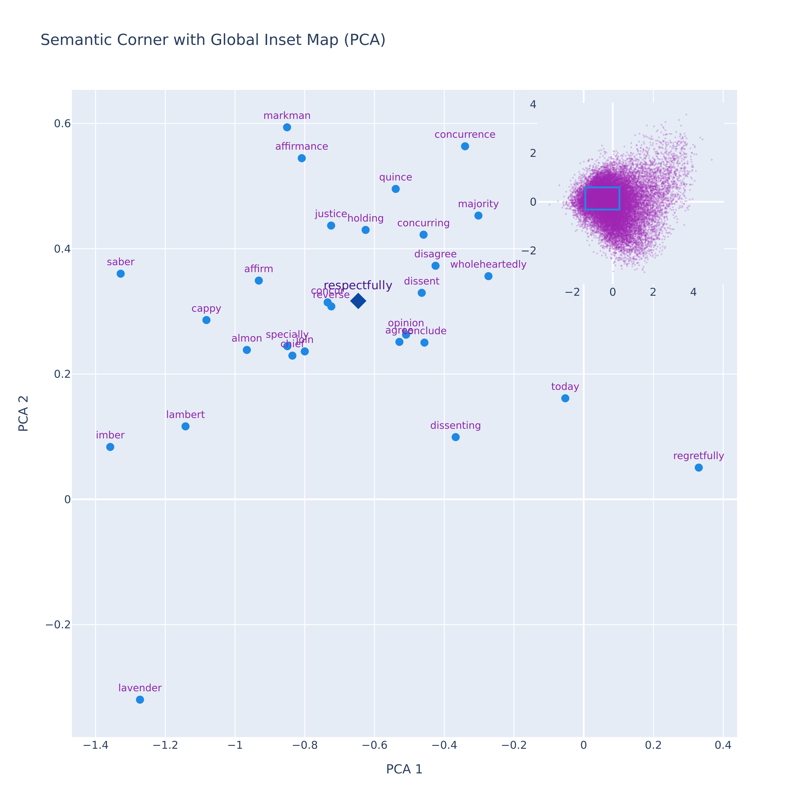
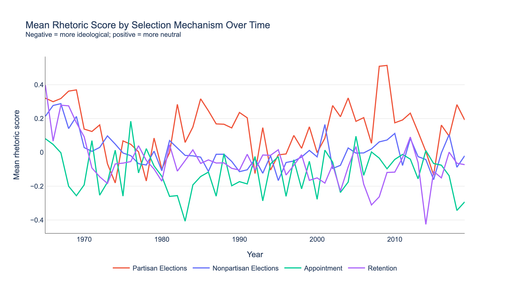
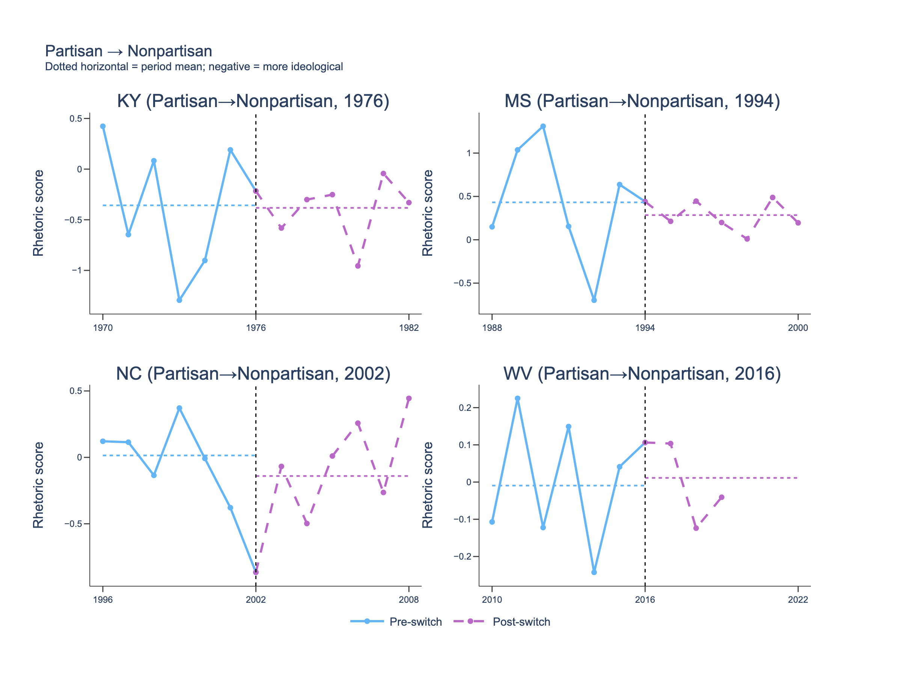
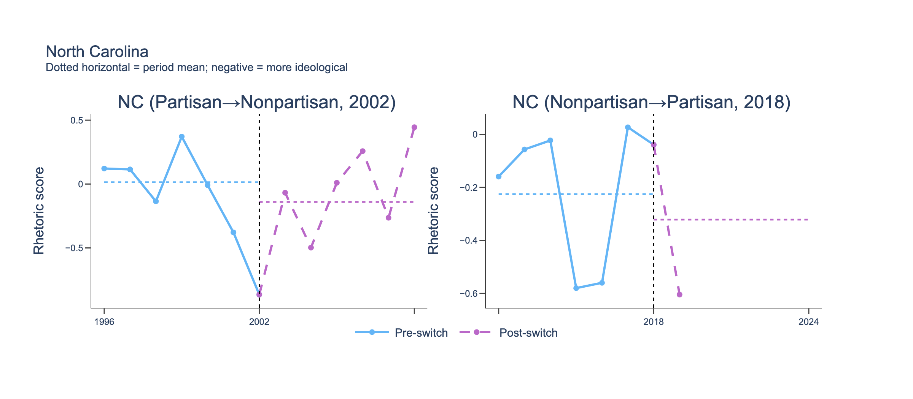

\begin{titlepage}

    \centering

    \vspace*{\fill}

    {\normalsize State Supreme Court Selection Mechanisms and Dissent\par}

    \vspace{1.0cm}

    {\normalsize Alexandria Emma Nagy\par}

    \vspace{0.25cm}

    {\normalsize Professor Nicolette Bruner\par}
    
    \vspace{0.25cm}

    {\normalsize Advanced Research Seminar\par}
    
    \vspace{0.25cm}

    {\normalsize March 13, 2026 \par}

    \vspace*{\fill}

\end{titlepage}
 
\newpage

\pagenumbering{gobble}

## Abstract

Partisan judicial selection reforms occurring across states raise concerns among scholars over judicial independence, yet existing measures that rely on dissent rates as an expression of judicial independence inadequately capture *how* justices dissent. This study employs mixed-methods to examine the relationship between selection mechanisms, dissent frequency, and the rhetorical content of dissents across state supreme courts. A synthetic control analysis of North Carolina's 2017 transition to partisan elections finds no reliable effect on dissent frequency. Yet a computational textual analysis of 72,480 state supreme court dissents between 1965 and 2019 finds that rhetoric varies across selection mechanisms: partisan-elected courts associated with the most ideologically concordant language, followed by nonpartisan-elected courts, retention courts, and appointment systems. Court composition partly mediates this pattern, as partisan elections that homogenize benches correspond with less ideologically discrepant rhetoric. These findings raise questions about whether mechanisms promoting ideological unity or diversity better foster judicial independence.

\newpage

\pagenumbering{arabic}
\setcounter{page}{1}

## I. Introduction

Scholars remain divided over which judicial selection mechanisms best reconcile the competing principles of judicial independence and democratic accountability.^[See @Hall2001 for an overview of the scholars involved in this debate.] Judicial independence requires courts to decide cases according to legal principles free from external pressure, whereas democratic accountability requires responsiveness to public values and societal needs. Reform advocates argue that partisan electoral systems create incentives to privilege party loyalty over legal reasoning and introduce party identification as a ballot heuristic that may unprofessionalize and homogenize the bench. Consequently, these advocates favor nonpartisan elections or merit-based selection systems, such as the Missouri Plan.^[The Missouri Plan is a judicial selection system in which a nonpartisan commission nominates candidates, the governor appoints one of the nominees, and the appointed justice later faces periodic retention elections in which voters decide whether the justice remains on the bench.] Reform opponents, however, emphasize the interpretive nature of judicial decision-making. Because judicial rulings inevitably reflect the legal philosophies of individual justices, they argue that partisan elections can enhance democratic accountability by encouraging justices to remain attentive to the values of the communities they serve without necessarily eroding judicial independence.

This debate has become increasingly relevant as the United States undergoes a profound transformation in its judicial landscape. Amid rising polarization and the Roberts Court's increasingly majoritarian constitutional order, SCOTUS has delegated responsibility for resolving many contentious national issues to the states. For example, federal oversight has been narrowed in areas such as campaign finance, partisan gerrymandering, abortion, and voting rights [@CitizensUnited; @Rucho; @ShelbyCounty; @Brnovich]. As the stakes of state-level adjudications rise, so too has the policy payoff of controlling state supreme courts. In response, state legislatures and partisan actors have restructured judicial selection mechanisms to increase direct political influence, often by replacing nonpartisan elections with explicitly partisan contests. Although such measures were ultimately defeated in Montana in 2025, North Carolina enacted a law in 2017 requiring judicial candidates to list party affiliation on primary and general election ballots, followed by Ohio in 2021 and West Virginia in 2025.^[See Ohio S.B. 80 (2021); N.C. Sess. Law 2016-125 (2016); W. Va. S.B. 521 (2025).] These developments raise questions about whether partisan judicial selection reforms will effectively deliver the political outcomes sought by those who view state judiciaries as vehicles for partisan reforms.

This debate has become increasingly salient as the United States undergoes significant changes in its judicial landscape. Amid rising political polarization and the Roberts Court’s increasingly majoritarian constitutional order, the Supreme Court has shifted responsibility for resolving many contentious policy disputes to the states. Federal oversight has narrowed in several areas, including campaign finance, partisan redistricting, abortion, and voting rights [@CitizensUnited; @Rucho; @ShelbyCounty; @Brnovich]. In response to the rising stakes of state-level adjudication, state legislatures and partisan actors have moved to restructure judicial selection to increase political influence. Although such measures to introduce partisan electoral systems were ultimately defeated in Montana in 2025, North Carolina enacted a law in 2017 requiring judicial candidates to list party affiliation on primary and general election ballots, followed by Ohio in 2021 and West Virginia in 2025.^[See Ohio S.B. 80 (2021); N.C. Sess. Law 2016-125 (2016); W. Va. S.B. 521 (2025).] These developments raise questions about whether partisan judicial selection reforms will produce the political outcomes sought by those who view state judiciaries as vehicles for partisan change.

Dissenting opinions offer a window into individual justices' legal philosophies and ideological commitments, making them a valuable lens for understanding judicial independence. This study advances the literature on dissent by addressing two underexplored gaps through a mixed-methods design focused on state supreme courts. The first concerns the direction of judicial selection reform. Building on Renberg's synthetic control approach, this study estimates the effect of the North Carolina Supreme Court's 2017 transition from nonpartisan to partisan elections on dissent rates. While Renberg examines increased dissent following transitions from partisan to nonpartisan elections, the reverse reform remains unexamined [@Renberg2020]. The second gap concerns the application of computational textual methods to state courts. Wordscores scaling, Word2Vec semantic embeddings, and an Evidence Minus Intuition (EMI) framework have been developed and validated in legislative contexts and extended primarily to SCOTUS, yet their application to state supreme courts remains comparatively limited. This study extends their use to the state level to distinguish two forms of dissenting rhetoric: ideologically concordant rhetoric, characteristic of politically moderate justices, and ideologically discrepant rhetoric, characteristic of justices at the partisan extremes. This analysis of rhetoric employed in dissenting opinions captures distinctions that dissent rates alone cannot, given their limitations of completeness, reproducibility, and construct validity [@Canon1970; @HallAndWindett2013; @Renberg2020].

The synthetic control analysis finds no reliable evidence that North Carolina's 2017 transition to partisan judicial elections affected dissent frequency, though several limitations preclude confident interpretation of this null result. The computational textual analysis of 72,480 dissenting opinions reveals that rhetoric scores vary systematically across selection mechanisms. Partisan-elected courts exhibit the most ideologically concordant rhetoric, followed by nonpartisan-elected courts, retention courts, and appointment systems. Part of this pattern is mediated by court composition. Partisan elections correspond with more ideologically homogeneous benches, while nonpartisan, retention, and appointment systems correspond with more ideologically heterogeneous benches. Ideological homogeneity corresponds with more concordant dissenting rhetoric, and ideological heterogeneity with more discrepant rhetoric. These findings implicate judicial independence by surfacing a fundamental tension between ideological unity and diversity across judicial selection mechanisms. These findings implicate judicial independence by highlighting a tension between ideological unity and diversity across judicial selection systems. As states implement reforms that push courts in a more partisan direction, they may increase ideological cohesion at the expense of dissenting voices.

## II. Literature Review

Scholarship is divided on whether dissent strengthens or undermines courts. Some scholars characterize the decision to write separately a destabilizing force that fosters division, undermines the authority of the majority, and generates uncertainty in the law [@Entrikin2017]. Extending this argument, Hall and Windett contend that chief justices have incentives to discourage dissent because it imposes reputational costs, weakens precedent, and invites additional appeals [@HallAndWindett2013]. Moreover, contributors to the Harvard Law Review argue that the presence of dissenting opinions can introduce political and doctrinal uncertainty into judicial deliberations, thereby complicating SCOTUS’s ability to project doctrinal clarity and institutional unity [@HarvardLawReview2011]. By contrast, other scholars view dissent as an essential mechanism of judicial independence. From this perspective, justices have a duty to articulate independent judgments, particularly in cases involving profound disagreement. Dissenting opinions preserve alternative interpretive frameworks, foster constitutional dialogue, and lay foundations for future doctrinal change [@Brennan1986; @Urofsky2015]. Doctrinal uncertainty within dissenting opinions may even enhance deliberation by surfacing disagreements that would otherwise remain obscured [@HarvardLawReview2011]. Empirically, dissent is frequently interpreted as a behavioral signal of independence, a justice’s willingness to challenge prevailing doctrine, advance alternative reasoning, and resist external pressures [@Renberg2020].

Accordingly, scholars examine the frequency of dissent as a meaningful indicator of judicial independence. One strand of literature operates at the interpersonal level, emphasizing the internal dynamics that promote consensus and discourage dissent. Jaros and Canon identify the role of strong chief justice leadership, high levels of social integration, and a prevailing norm of unanimity as forces that cultivate consensus [@Canon1970]. Related research supports that chief justices actively discourage dissent to preserve collegiality, reinforce precedent, and bolster public confidence. Consistent with this account, dissent rates tend to be lower on courts where the chief justice exercises greater formal authority and where members possess fewer institutional resources. By contrast, abundant institutional resources can dilute hierarchical control and facilitate separate opinion writing [@HallAndWindett2013]. Epstein, Landes, and Posner extend this line of inquiry by introducing the concept of “dissent aversion,” arguing that justices may strategically suppress disagreement to avoid its institutional costs. However, they find that this tendency weakens as ideological polarization intensifies and panel sizes expand, conditions that render consensus more difficult to sustain [@EpsteinLandesPosner2011].

Yet interpersonal dynamics alone cannot explain variation in dissent rates across courts. At the environmental level, Brace and Hall find that higher urbanization, greater political competition, and increased state spending are each associated with elevated dissent rates [@Brace1990]. Courts operating in such contexts confront a more diverse array of regulatory, commercial, civil rights, and criminal legal disputes that implicate competing interests and normative commitments. At the institutional level, Brace and Hall contend that court structure accounts for substantially greater explanatory power than these environmental factors [@Brace1990]. For example, the presence of intermediate appellate courts filters out routine cases, concentrating complex and high-conflict disputes at courts of last resort, thereby increasing the likelihood of dissent in these jurisdictions.^["Court of last resort" is used interchangeably with "state supreme court."] Random assignment of opinions further facilitates dissent by limiting the chief justice’s ability to allocate authorship strategically as a reward or sanction. Conversely, conference procedures organized around seniority norms encourage consensus by creating reputational and hierarchical incentives against open disagreement. Jaros and Canon additionally find that dissent rises with court size, where coordination costs are higher and ideological dispersion more likely, and declines with longer judicial tenure, which reinforces norms of collegiality and institutional cohesion [@Canon1970].

The scholarship most directly relevant to the present study investigates how judicial selection mechanisms influence dissent rates. Brace and Hall find that appointed justices tend to foster consensus, whereas elected justices display higher levels of dissent [@Brace1990]. Jaros and Canon report a comparable pattern, noting that popularly elected courts dissent more frequently than their appointed counterparts [@Canon1970]. Hall and Windett offer a systematic comparison across four selection mechanisms, including gubernatorial or legislative appointment systems, the Missouri Plan, nonpartisan elections, and partisan elections. They conclude that longer tenures, greater professionalization, and insulation from electoral pressures enable appointed and Missouri Plan courts to sustain consistently low dissent rates [@HallAndWindett2016]. By contrast, courts selected through nonpartisan elections exhibit consistently higher dissent rates, indicating that electoral incentives shape judicial behavior even in the absence of party labels. Partisan election courts display the most pronounced and unstable dissent patterns, which the authors attribute to the distinct reelection pressures inherent in partisan election systems. Extending this line of inquiry, Renberg employs synthetic control methods to assess how changes in judicial selection mechanisms affect dissent rates on state supreme courts. She finds that removing partisan labels from ballots increases dissent, indicating that justices strategically constrain their jurisprudential reasoning under partisan pressures and exercise greater independence when party identifiers are absent [@Renberg2020].

However, this literature examining the effects of judicial selection mechanisms on dissent rates faces two primary challenges. The first challenge concerns data availability. The Findable, Accessible, Interoperable, Reusable (FAIR) principles emphasize that scientific data should be findable, accessible, interoperable, and reusable [@WilkinsonFAIR2016], yet data on dissent rates remain sparse and difficult to access. The State Supreme Court Data Project, often described as the premier database for state supreme court research, covers only four years (1995–1998) [@StateSupremeCourtProject]. Hall and Windett attempted to address this by releasing a dataset of state supreme court opinions, but their data is currently inaccessible and their accompanying code relies on web scraping methods prohibited under LexisNexis' terms of service [@HallAndWindett2013]. While LexisNexis offers comprehensive access to published opinions, its proprietary structure limits transparency for researchers without bulk-access subscriptions. Open-source alternatives, such as CourtListener, provide greater accessibility but feature substantially less comprehensive case coverage. The second challenge is reproducibility. Scholars frequently present dissent rate data through graphical depictions without clearly documenting the measurement conventions, inclusion criteria, or database parameters underlying their estimates [@Renberg2020]. Because multiple operationalizations of dissent are plausible, varying by query construction, opinion type, and database, estimated rates are highly sensitive to methodological choices.^[See the appendix for a table detailing attempts to replicate the dissent rate measures reported in Renberg (2020) and Hall and Windett (2013) using both CourtListener and LexisNexis. In CourtListener, searches were limited by court and refined with advanced opinion-type operators (e.g., combined, unanimous, lead, plurality, concurrence, in-part, dissent, addendum, remittitur, rehearing, on-the-merits, and on-motion-to-strike). LexisNexis queries employed the OpinionBy and DissentBy fields and the “find by source” function. Multiple approaches were tested to collect dissent rates, including querying all justices serving between 1995 and 2010 and restricting results to full merits opinions by excluding terms such as “dismiss!,” “petition for review,” and “motion for” using AND NOT operators. Across databases and query configurations, estimated dissent rates failed to replicate Renberg’s graphs or Hall and Windett’s reported figures.] Without detailed documentation of coding rules and data provenance, baseline dissent rates cannot be independently verified, limiting the field's ability to build cumulatively on prior work.

Beyond these limitations, examining dissent frequency alone offers only a partial understanding of the ideological and strategic considerations that shape judicial opinion-writing (Bailey and Maltzman, 2011; Hinkle, 2015; Songer and Lindquist, 1996). The type of rhetoric employed in crafting dissenting opinions mediates whether disagreement is perceived as principled independence or as conduct that undermines SCOTUS’s integrity and legitimacy. Scholarship in the Harvard Law Review provides a framework for understanding the “respectful dissent,” emphasizing how collegial rhetoric signals acknowledgment of the majority’s legitimacy while preserving the dissenter’s independence as a reasoned and impartial jurist [@HarvardLawReview2011]. Conversely, scholars show that justices at the appellate level who employ respectful rhetoric often anticipate the preferences of their colleagues, moderate their positions, tailor their opinion language, or withhold dissent when doing so would be futile or costly. This suggests that collegial tone may instead function as a behavioral constraint that undermines judicial independence in an effort to preserve institutional legitimacy [@HettingerLindquistMartinek2006].

For much of the early history of the United States, dissenting opinions were exceedingly rare. Norms of institutional unity were so entrenched that SCOTUS justices who chose to write separately often felt compelled to preface their dissent with an apology for departing from the majority. Even after dissenting became more common, justices adhered to a cordial tone. By the late nineteenth century, justices increasingly used dissenting opinions to articulate their individual jurisprudential commitments, and some dissenting opinions were later vindicated by doctrinal change and effectively became law. These political outcomes strengthened incentives for minority justices to preserve their positions through separate writing. The contentious disputes of the New Deal era produced increased ideological dissonance, yet the norm of dissenting "respectfully" persisted for the next three decades, until openly critical dissenting opinions began to signal a broader transformation in the tenor of judicial opinion-writing [@Entrikin2017]. 

This tension between respectful and assertive rhetoric in dissenting opinions, and its implications for judicial independence among the transforming tenor of judicial opinion-writing, is exemplified by the dialogue between Justice Scalia and Chief Justice Hughes. Known for his frequent, confrontational, and "acerbic" dissenting opinions, Scalia argued that assertive dissenting opinions are the product of “independent and thoughtful minds” rather than justices who prioritize consensus merely to advance institutional ends. By contrast, Chief Justice Hughes emphasized that judicial independence is inseparable from SCOTUS’s reputation, which rests fundamentally on the character of its justices. He cautioned that independence is threatened by “cantankerousness," or persistent ill temper, argumentativeness, or uncooperativeness. Instead, he advocated for norms of civility and collegiality in dissent, viewing them as expressions of a deeper appreciation for SCOTUS’s democratic role, and maintaining that public confidence in SCOTUS’s institutional integrity is itself essential to sustaining judicial independence. Accordingly, while Scalia’s assertive and confrontational rhetoric may seek to signal judicial independence, Hughes underscores that such challenges to the majority’s authority can ultimately jeopardize the very institutional legitimacy the dissenter purports to defend [@Entrikin2017].

Note: I have not yet done the footnotes for the rest of the literature review. I will implement them today.

A growing body of scholarship has adopted computational textual analysis to examine rhetoric in legislative texts. The intellectual premise for these approaches is articulated by Truscott and Romano (2025), who argue that terminology functions as a deliberate expression of ideology. For instance, the terms “healthcare provider” and “abortionist” both refer to the same category of medical professional, yet each conveys markedly different ideological valences and signals alignment with competing moral, political, or policy perspectives. Three foundational scaling approaches have been particularly influential. First, Wordscores is an unsupervised method that relies on reference documents to compare word frequencies between texts. A primary advantage of Wordscores is that it minimizes human error and the need for intensive hand-coding (Laver, Benoit, and Garry, 2003). Second, Wordfish estimates actor positions from word frequencies using a Poisson distribution, removing the requirement for predefined reference documents (Slapin and Proksch, 2008). Third, Wordshoal is a two-stage hierarchical extension of Wordfish designed to estimate latent preferences from expressed positions in legislative speech (Lauderdale and Herzog, 2016). Despite the sophistication of these methods in legislative research, their application to judicial behavior has lagged, partly due to the distinctive structural features of judicial text production. Unlike legislative speeches, which are directly attributable to individual members, judicial opinions are collaborative products authored by one justice but joined by several others, complicating the attribution of textual content to individual ideological positions. 

Nonetheless, the literature has made substantial progress. Hauslauden, Schubert, and Ash use a 5% hand-coded sample of cases from U.S. Circuit Courts to predict liberal and conservative ideological directions in judicial decisions. Bailey and Maltzman (2011) investigate the use of ideologically loaded terms in dissenting opinions, demonstrating that certain word choices correlate with more assertive or confrontational dissenting opinions. Moreover, Songer and Lindquist (1996) examine language patterns to identify how justices signal disagreement subtly, adjusting rhetoric based on anticipated reactions from colleagues or the broader public. Lauderdale and Clark integrate topic modeling into the scaling of judicial preferences, demonstrating that incorporating Latent Dirichlet Allocation (LDA) derived issue dimensions alongside voting data enables multidimensional mapping of justice-level ideal points that purely vote-based models cannot achieve. Hausladen et al. train classification models on Courts of Appeals opinions, demonstrating that ideological direction is predictable from opinion language alone. An expert-elicitation-text hybrid developed by Cope (2024) uses a hierarchical n-gram analysis of lawyer assessments to recover dynamic ideology scores by treating practitioner language as a structured ideological signal rather than relying on the opinions themselves. Truscott and Romano (2025) adapt the Wordshoal approach from legislative speech to judicial opinions. Altogether, this literature has demonstrated that ideological signals are recoverable from the written text of judicial opinions.

Despite these advances, significant gaps in the literature remain. Renberg contends that the SCM provides a robust causal measure of the effects of selection mechanisms on dissent rates. However, her findings have not been independently validated. Moreover, scholars have yet to examine the inverse transition from nonpartisan to partisan election systems. Additionally, the body of scholarship employing computational text analysis to study the rhetoric within texts has been overwhelmingly concentrated in the legislative branch, where tools such as Wordscores, Wordfish, and Wordshoal were initially developed and validated. Extensions of these methods to judicial texts have focused primarily on SCOTUS and federal circuit courts, leaving state supreme courts largely unexplored. The present study seeks to address these gaps by applying SCM to examine the effects of transitioning from nonpartisan to partisan election systems on dissent rates and by deploying the Wordscores framework to a comprehensive corpus of state supreme court opinions.

## III. Methodology

This study employed a mixed-methods design to examine the relationship between selection mechanisms, dissent frequency, and the rhetorical content of dissents across state supreme courts. The first component used the Synthetic Control Method (SCM) to estimate the causal effect of North Carolina's 2017 transition from nonpartisan to partisan elections on dissent rates.^[SCM was originally developed by Alberto Abadie and Javier Gardeazabal and later extended by Alexis Diamond and Jens Hainmueller [@Abadie2003; @Abadie2010].] SCM constructed a weighted combination of control courts that closely approximated the pre-reform characteristics of the North Carolina Supreme Court, creating a synthetic counterfactual. Divergences between the dissent rates of the North Carolina Supreme Court and those of its synthetic counterpart in the post-reform period then formed the basis for causal inference. The second component applied computational textual analysis in four stages. First, a Word2Vec model was trained on preprocessed opinion text. Second, the Wordscores method produced seed-word dictionaries capturing ideologically discrepant and concordant rhetoric. Third, these dictionaries were expanded to include contextually similar words using Word2Vec. Finally, an Evidence Minus Intuition (EMI) framework was applied to the corpus to generate a rhetoric score for each dissent.^[The EMI framework was originally developed by Segun Taofeek Aroyehun and colleagues to analyze the shift from evidence- to intuition-based language employed in U.S. congressional speeches [@Aroyehun2025].]

North Carolina's transition from nonpartisan to partisan judicial elections was enacted by statute in 2017 and first implemented in the November 6, 2018 election. Therefore, this study treated 2018 as the treatment year. SCM was well suited to estimate the effect of this reform because no other state supreme court experienced a comparable transition during the same period, leaving no natural comparison group. The synthetic counterfactual was constructed from a donor pool of seven state supreme courts that consistently maintained nonpartisan elections throughout the study period: Arkansas, Georgia, Kentucky, Minnesota, Montana, Oregon, and Wisconsin. SCM assigned weights to these donor courts based on their pretreatment characteristics, summarized in Table \ref{tab:pretreatment}, to produce a synthetic counterpart whose pre-reform dissent rate trajectory closely approximated North Carolina's. Because the donor courts did not undergo the reform, divergences between North Carolina and its synthetic counterpart in the post-reform period could be attributed to the change in selection mechanism.

\begin{table}[H]
\captionsetup{justification=raggedright, singlelinecheck=false, skip=3pt} % less space before caption
\caption{Pretreatment Characteristics}
\label{tab:pretreatment}
\centering
\setstretch{1.0}
\renewcommand{\arraystretch}{0.95}

\newcolumntype{H}{>{\raggedright\arraybackslash\hangindent=1em\hangafter=1}X}
\newcolumntype{V}{>{\raggedright\arraybackslash\hangindent=1em\hangafter=1}p{4cm}}

\begin{tabularx}{\textwidth}{@{} V H >{\raggedright\arraybackslash}p{3.6cm} @{}}
\toprule
\textbf{Variable} & \textbf{Operationalization} & \textbf{Source Initiative} \\
\midrule
Term Length &
Count of years between judicial elections. &
Ballotpedia \\

Number of Justices &
Count of justices on the bench. &
Ballotpedia \\

Professionalization Score &
Professionalism index based on the Court Statistics Project. &
Squire (2021) \\

Campaign Fundraising &
Amount, in dollars, of reported campaign funds raised. &
Open Secrets \\

Number of Capital Punishment Cases &
Count of capital punishment cases reviewed. &
Lexis Nexis \\

Number of Lower Court Capital Punishment Cases &
Count of capital punishment cases reviewed in the previous year by lower courts. &
Lexis Nexis \\

Number of Published Opinions &
Count of reported opinions. &
Lexis Nexis \\

Single-Member Election District &
Valued at one if the state uses single-member districts and valued at zero otherwise. &
Ballotpedia \\

Percent of Docket Concerning Criminal Procedure &
Number of reported criminal procedure cases divided by the number of reported cases. &
Lexis Nexis \\

Competitive Election &
Valued at one if the average victory margin in the most recent election was less than 10\% and zero otherwise. &
Ballotpedia \\

Ideological Spread &
Absolute difference in cfscores between the most and least liberal justice in the court. &
Bonica (2024) \\

State Citizen Ideology &
Mean ideological self-placement of all respondents in a state, aggregated from individual ANES survey responses. &
ANES Time Series Study (2024) \\

State Government Ideology &
Mean of first-dimension NOMINATE scores for congressional members (House and Senate) &
Voteview (2026) \\
\bottomrule
\end{tabularx}
\end{table}

FIX 38 AND 39 FOOTNOTES WHAT THE HECK

Pretreatment covariates were collected annually between 2012 and 2024 for the North Carolina Supreme Court and each control court. Structural features including term length, number of justices, single- versus multimember election districts, and electoral competitiveness were obtained from Ballotpedia [@Ballotpedia]. Campaign finance data, operationalized as the total funds raised by candidates in the most recent election for each year, were collected from the National Institute on Money in Politics [@FollowTheMoney]. Court professionalization scores measuring staff size, judicial pay, and docket control were drawn from Squire and Butcher's updated 2019 index [@Squire2021].^[Due to Squire and Butcher's discussion of the relative stability of court professionalization scores, the 2019 values are assumed unchanged for each court throughout the study period.] Caseload characteristics, including the number of published opinions, capital punishment appeals reviewed, capital cases resolved by lower courts in the prior year, and the proportion of the docket devoted to criminal procedure, were obtained from LexisNexis [@LexisNexis]. Court ideological spread was measured using Bonica's common space campaign finance (CF) scores [@DIME]. Because state citizen and government ideology measures from Berry et al. are unavailable for the study period, state citizen ideology was approximated using aggregated responses from the 2024 American National Election Studies (ANES) Time Series Study [@Berry1998; @2024TimeSeries]. State government ideology was operationalized as the mean first-dimension NOMINATE score of all congressional members in each state [@Berry2010; @Voteview2026].

SCM faced a series of limitations. First, the structural heterogeneity of state supreme courts complicated the construction of a credible synthetic counterfactual. The North Carolina Supreme Court exercises direct appellate jurisdiction over constitutional questions and statutory challenges, allowing some cases to bypass the intermediate Court of Appeals and generating a substantially higher volume of published opinions than most comparable courts [@CourtStructureNC]. Because docket size can suppress dissent rates, this distinctiveness limited the availability of comparable donor courts [@EpsteinLandesPosner2011]. Second, institutional disruptions associated with the COVID-19 pandemic beginning in 2020, including court closures, delayed proceedings, and shifts in case composition, introduced additional noise into the posttreatment period. Third, even a well-fitted synthetic control model captures only the frequency of dissent, which is itself an incomplete behavioral indicator. A higher dissent rate does not necessarily indicate greater judicial independence, as justices may dissent for strategic reasons unrelated to independence, such as signaling to political audiences or positioning for appointment opportunities. To address these limitations, the study applied computational textual analysis to explore the substantive content of dissenting opinions directly.

The textual analysis drew on a dataset of 72,480 dissenting opinions issued by state supreme court justices between 1965 and 2019. These opinions were collected from the Collaborative Open Legal Data (COLD) Cases dataset. COLD Cases is a repository containing more than 8.3 million U.S. legal decisions compiled from CourtListener [@COLDcases]. While COLD Cases offers broader and more accessible coverage than proprietary alternatives, it inherits CourtListener's gaps in opinion coverage. The dataset also extends only through 2019, truncating the posttreatment observation window for the North Carolina Supreme Court's transition to a single year. A Word2Vec neural embedding model was then trained on this corpus of dissenting and dissenting-in-part opinion texts using a skip-gram architecture. Word2Vec learns vector representations of words from their surrounding context, placing semantically similar terms nearby in the embedding space. This attention to contextual relationships between words makes Word2Vec preferable to bag-of-words methods, which discard them entirely.^[Bag-of-words methods represent documents as vectors of word counts or frequencies, ignoring word order and semantic relationships. Common examples include raw term frequency matrices and Term Frequency–Inverse Document Frequency (TF-IDF) weighting.] The trained Word2Vec model defined the vector space used in all subsequent analyses.

Next, Wordscores was used to construct seed-word dictionaries from two reference corpora anchored in the known ideological positions of justices [@LaverBenoitGarry2003]. Wordscores is a supervised scaling method that compares word frequencies across reference documents to identify terms disproportionately associated with each reference group. The ideological positions of justices were established using Party-Adjusted Surrogate Judge Ideology (PAJID) scores, which incorporate party affiliation, state political climate, and the ideology of the justices' selectors [@BraceLangerHall2000]. Available from 1970 to 2019, PAJID scores range from 0 (most conservative) to 100 (most liberal), with 50 representing the ideological center. The first reference corpus consisted of dissenting opinions authored by the ten percent of justices with the most extreme PAJID scores: 0–5 on the conservative end and 95–100 on the liberal end. The second corpus included dissenting opinions authored by justices in the middle ten percent of the ideological spectrum, with PAJID scores between 45 and 55. These two corpora were designed to capture the distinction between ideologically discrepant and concordant rhetoric. Dissents by justices at the ideological extremes are assumed to reflect stronger political commitments in legal reasoning, while dissents by centrist justices are assumed to reflect more concordant reasoning in which procedural norms and established doctrine carry greater weight than partisan alignment.

Weighted term frequencies for each corpus were calculated using Term Frequency–Inverse Document Frequency (TF-IDF), which measures a word's importance within a document relative to the corpus.^[TF-IDF increases with a word’s frequency within a document (term frequency, TF) but decreases with its overall frequency across the corpus (inverse document frequency, IDF), down-weighting common terms that appear in many documents and are therefore less informative for distinguishing between corpora.] Wordscores for each reference group were then computed by weighting each word’s TF-IDF frequency by the authoring justice’s absolute PAJID deviation:

$$W_w = \frac{\sum_{d \in R} f_{wd} \cdot |s_d - 50|}{\sum_{d \in R} f_{wd}}$$
where $W_w$ is the score for word $w$, $R$ is the set of reference texts, $f_{wd}$ is the TF-IDF–weighted frequency of $w$ in document $d$, and $|s_d - 50|$ is the absolute PAJID deviation of the authoring justice. Words were ranked based on the difference between their ideologically discrepant and concordant scores. Words with the largest positive differences formed the discrepant seed-word dictionary, while words with the largest negative differences formed the concordant seed-word dictionary. Each dictionary was then expanded using Word2Vec to incorporate semantically related terms with a cosine similarity > 0.65.

Rhetoric scores were then calculated by adapting the Evidence Minus Intuition (EMI) framework to quantify ideologically discrepant versus concordant rhetoric in dissenting opinions [@Aroyehun2025]. EMI is well suited to the present analysis because it produces a continuous score reflecting the relative balance between two groups of rhetoric within a document. EMI operates by comparing concept vectors and document vectors. Concept vectors were constructed by averaging the embeddings of all words in each expanded dictionary.^[Embeddings are numerical representations of words as vectors. "Vectors" are lists of numbers, and "embedding" refers to the process and result of mapping a word into that vector space.] Document vectors were constructed by averaging the embeddings of whichever dictionary words appeared in each dissenting opinion's text. The EMI framework then calculated the cosine similarity between each document vector and each concept vector, producing discrepant and concordant similarity scores. These scores quantify the extent to which the vocabulary from each dictionary appears in a given dissenting opinion. The final rhetoric score was computed by subtracting the discrepant from the concordant similarity score, such that positive values indicate stronger ideologically concordant rhetoric and negative values indicate stronger ideologically discrepant rhetoric. The final rhetoric score is defined as:

$$\text{Rhetoric Score} = \text{CosSim}(\text{doc}, \text{condordant}) - \text{CosSim}(\text{doc}, \text{discrepant})$$

Rhetoric scores were analyzed in three stages. First, panel OLS regressions with state fixed effects and clustered standard errors were used to assess whether rhetoric varied systematically across judicial selection mechanisms and over time.^[State fixed effects account for time-invariant differences between courts that could otherwise confound comparisons across selection mechanisms.] Standard errors were clustered by state to account for within-state correlation and produce more conservative significance estimates.^[Ignoring correlations within states would treat each court-year as independent, producing artificially small standard errors and inflated significance levels. Clustering corrects for this by recognizing that repeated observations from the same court carry less independent information than observations from different courts.] Second, because fixed effects cannot account for time-varying confounders that coincide with a mechanism switch, event studies provided a closer look at how rhetoric shifted within specific courts around the moment of reform. For each of the twelve selection mechanism switches during the study period, mean rhetoric scores were compared for the six years before and after the reform. T-tests were used to evaluate the significance of pre- and post-switch differences, and sign tests assessed directional consistency across cases. Third, the analysis examined the role of court composition as a potential mediator. A simple OLS without state fixed effects tested whether selection mechanisms predicted ideological spread among justices, whether that ideological spread in turn predicted rhetoric scores after controlling for selection mechanisms, and whether the effect of selection mechanisms on rhetoric diminished once ideological spread was included.

## IV. Analysis

The synthetic control analysis estimates a treatment effect of effectively zero, finding no reliable evidence that North Carolina's 2018 transition to partisan judicial elections affected dissent frequency. However, diagnostic tests reveal substantial methodological limitations, including poor model fit, lopsided donor weighting, significant covariate imbalance, and unstable sensitivity tests. These limitations collectively undermine confidence in the null finding, and raise questions as to whether SCM is an appropriate method for studying dissent behavior across highly heterogeneous state supreme courts. The computational textual analysis finds that rhetoric varies systematically across selection mechanisms. Partisan-elected courts exhibit the most ideologically concordant rhetoric, followed by nonpartisan, retention, and appointment courts in descending order. Event studies find that transitions to retention elections consistently produce more ideologically discrepant rhetoric, while transitions between partisan and nonpartisan elections show fewer systematic effects. A mediation analysis finds that this pattern partly reflects court composition: partisan elections correspond with more ideologically homogeneous benches and more concordant rhetoric, while nonpartisan, retention, and appointment systems correspond with greater ideological diversity and more discrepant rhetoric

### IV.A.1 Synthetic Controls Results

{fig-pos="H"}

As shown in Figure \ref{dissent_rates}, North Carolina's dissent rate remained consistently low at around one percent from 2012 to 2017 before rising to 1.9 percent in 2018 and 4.5 percent in 2020 and declining to 2.2 percent in 2021 amid COVID-19-related court closures. Dissent rates among the donor courts displayed substantially greater variation. Wisconsin recorded the highest levels, frequently exceeding fifty percent and peaking at eighty-eight percent in 2016. This pattern likely reflects data limitations rather than genuine behavioral differences, as opinion texts were frequently unavailable for Wisconsin, inflating calculated dissent rates when using LexisNexis's OpinionBy query function. Arkansas also exhibited considerable volatility, ranging from 7.7 percent in 2012 to more than fifty percent between 2018 and 2020. Georgia and Minnesota displayed relatively stable patterns with dissent rates typically remaining below ten percent.

{fig-pos="H"}

As shown in Figure \ref{scm}, the synthetic control analysis estimates a treatment effect of 0.000 percent, indicating no detectable change in dissent frequency following North Carolina's adoption of partisan judicial elections in 2018. Renberg finds that transitions from partisan to nonpartisan election systems increase dissent rates, suggesting that justices exercise greater independence when freed from partisan electoral pressures [@Renberg2020]. The present analysis finds no analogous effect in the reverse transition. A placebo test provides tentative support for this null result: reassigning the treatment year to each pre-intervention year between 2014 and 2017 produces systematic gaps between the North Carolina Supreme Court and its synthetic counterpart. The observed 2018 treatment effect of 0.000 percent is distinguishable from estimated placebo effects ranging from −2.62 percent to −3.78 percent with a mean of −2.92 percent at conventional significance levels (p = 0.042), suggesting that the post-reform estimate does not simply reflect pre-treatment variation. However, the sections that follow demonstrate that several methodological limitations provide alternative explanations for this null finding, raising doubts about the robustness of the SCM results.

### IV.A.2. Model Fit

Mean Squared Prediction Error (MSPE) serves as the principal diagnostic for assessing the validity of the synthetic control design. Substantively, it measures how closely the synthetic unit reproduces the treated unit's pre-intervention trajectory. A low pretreatment MSPE is necessary for credible inference because it indicates that the synthetic unit approximates a plausible counterfactual prior to reform. Under these conditions, any subsequent divergence can reasonably be attributed to the institutional change rather than model misspecification. In this study, MSPE is calculated as the average squared difference between North Carolina's observed dissent rates and those predicted by its synthetic counterpart. The pretreatment MSPE for the period between 2012 and 2017 is 0.0007. This small value appears to indicate a strong fit between the synthetic and observed trajectories of the North Carolina Supreme Court. However, baseline dissent rates on the court are extremely low and tend to cluster in discrete periods. In such contexts, small absolute MSPE values may simply reflect the scale of the outcome variable rather than meaningful alignment between trajectories. Figure \ref{scm} illustrates this limitation, showing poor alignment between actual and synthetic trends despite the low numerical value. Additional limitations are evident in the posttreatment fit. If the adoption of partisan elections had altered dissent behavior, the posttreatment MSPE is expected to increase due to a divergence between the treated court and its synthetic counterfactual. Instead, the posttreatment MSPE for 2018 to 2024 declines to 0.0002. The resulting post-to-pre MSPE ratio of 0.29 reflects that the model tracks North Carolina more closely in the posttreatment period than before the reform, offering no support for the conclusion that the adoption of partisan elections measurably affected dissent rates.

### IV.A.3. Donor Weights and Covariate Balance

\begin{table}[H]
\captionsetup{justification=raggedright, singlelinecheck=false, skip=5pt}
\caption{Covariate Balance Between Treated and Synthetic North Carolina}
\label{tab:covariate_balance}
\centering
\setstretch{1.0}
\begin{tabular}{lccc}
\hline
\rule{0pt}{3ex}\textbf{Covariate}
& \textbf{Treated (NC)}
& \textbf{Synthetic NC}
& \textbf{Sample Mean} \\[1ex]
\hline
Campaign Finance        & 1,348,421 & 177,336 & 381,739 \\
Court Professionalization & 0.609 & 0.610 & 0.612 \\
Capital Appeals         & 0.167 & 0.333 & 2.548 \\
Lower Court Capital Appeals & 1.000 & 0.500 & 1.548 \\
Criminal Procedure Docket & 0.458 & 0.129 & 0.519 \\
Ideological Spread      & 2.283 & 1.964 & 1.291 \\
Citizen Ideology        & 3.903 & 4.161 & 3.933 \\
Government Ideology     & 0.240 & -0.093 & 0.147 \\
Term Length             & 8.000 & 6.000 & 7.429 \\
Number of Justices      & 7.000 & 7.000 & 7.286 \\
Election Structure      & 0.000 & 0.000 & 0.143 \\
Electoral Competition   & 0.667 & 0.000 & 0.167 \\
Published Opinions      & 1,057 & 657 & 224 \\
\hline
\end{tabular}
\end{table}

The distribution of donor weights and pretreatment covariate balance present further limitations that undermine confidence in the null result. The synthetic control algorithm assigns one hundred percent of the donor pool weight to the Minnesota Supreme Court, forgoing one of SCM's core advantages by concentrating the entire counterfactual on a single donor. Although it is not uncommon for SCM to allocate weight unevenly across donors or to exclude some entirely, this is substantively reassuring only when the selected unit closely matches the treated unit on pretreatment characteristics [@QiangLi2024]. As Table \ref{tab:covariate_balance} shows, this condition is not met in the present study. Eleven of fourteen covariates exceed a 0.25 standardized difference threshold, with especially pronounced discrepancies in campaign finance ($1.35 million versus $177,336), criminal procedure dockets (0.458 versus 0.129), capital appeals (0.167 versus 0.333), and election competitiveness (0.667 versus 0.000). The complete allocation of donor weight to Minnesota therefore reflects constrained optimization under conditions of poor pretreatment balance rather than a genuine structural resemblance between the two courts. This limitation is not unique to the present study. Although Renberg does not explicitly discuss it, her synthetic control model predicts between ninety-two percent and four hundred and ninety-four percent more published opinions than the treated courts actually produced, underestimates criminal procedure dockets by roughly fifty percent in Arkansas and Mississippi, and produces pronounced divergences in capital punishment caseloads [@Renberg2020]. These imbalances raise questions about whether the observed increases in dissent rates following transitions to nonpartisan elections reflect a genuine behavioral response to reduced partisan pressures, or whether they are artifacts of poor pretreatment balance between treated and donor courts.

### IV.A.4. Sensitivity Tests

Additional sensitivity tests, including leave-one-out, placebo, and year-by-year analyses, further highlight the fragility of any potential causal inference. The leave-one-out analysis systematically removes each donor court from the pool and re-estimates the synthetic control, testing whether the null result holds regardless of which courts are included. If the estimated treatment effect remains stable across these exclusions, it provides evidence that the result is not driven by any single donor. By contrast, treatment effects vary substantially, ranging from −0.1887 when Minnesota is excluded to −0.0875 when Wisconsin is excluded, with a mean of −0.1617 and a standard deviation of 0.0382. This variation suggests that the null result reflects the weighting scheme rather than a reliable causal effect. Comparing the algorithm's optimal weights to artificially equalized weights produces the same estimated average treatment effect (ATE = 0.00), indicating that the sophisticated weighting provides no advantage over a simple average of control courts. Year-by-year treatment effects measuring the difference between observed dissent rate and the synthetic control's prediction for each individual posttreatment year further highlight temporal instability, fluctuating from −0.0123 in 2018 to +0.0270 in 2022, with a standard deviation nearly as large as the effects themselves (0.0152). Rather than showing a consistent directional response to the 2018 reform, this pattern suggests the differences between the North Carolina Supreme Court and its synthetic counterpart reflect annual noise rather than a systematic behavioral response to institutional change.

Altogether, the poorly fitted MSPE, lopsided donor weighting, substantial covariate imbalances, and unstable sensitivity tests collectively indicate that the null result cannot be interpreted with confidence. These diagnostic failures are further compounded by the structural distinctiveness of the North Carolina Supreme Court and the institutional disruptions of the COVID-19 pandemic. Addressed in the methodology section, these contexts limit the availability of genuinely comparable donor courts and introduce additional noise into the posttreatment period. Beyond these methodological concerns, the imbalances identified across both studies invite scrutiny of the theoretical premise underlying Renberg's interpretation. The assumption that justices dissent more freely once partisan electoral pressures are removed treats dissent frequency as a direct expression of judicial independence. Yet justices may dissent for reasons inconsistent witb independence, including strategically signaling to political audiences or posturing for appointment opportunities. Dissent frequency alone cannot distinguish between these possibilities. Collectively, these findings highlight the broader challenges of applying SCM to dissent rates across highly heterogeneous state supreme courts, and motivate the study's turn to computational textual analysis as a more reliable window into how selection mechanisms shape judicial behavior.

### IV.B.1. Wordscores Seed Dictionaries

The textual analysis begins with construction of the seed dictionaries. Wordscores was applied to reference corpora anchored in PAJID scores to identify words disproportionately associated with ideologically discrepant and concordant dissents, producing two seed-word dictionaries that form the basis for analyzing rhetoric scores. The resulting seed terms are shown in Figure \ref{wordclouds}. Both dictionaries were manually reviewed, with a small number of generic terms or parsing errors excluded.

{fig-pos="H"}

Words in the ideologically discrepant dictionary appear to refer to constitutional questions and substantively contested legal domains. For example, terms such as *search*, *warrant*, *police*, and *prosecution* may indicate attention to the Fourth Amendment and the exercise of state power; *regulation*, *legislative*, *administrative*, and *agency* may reflect engagement with debates over the scope of government authority; *drug*, *harm*, and *parent* may correspond to criminal and family law issues where ideological priors can shape reasoning; and *meaning* and *challenge* may reflect interpretive or adversarial engagement with the majority. These patterns are consistent with the assumption underlying the approach that justices with more extreme PAJID scores are more likely to frame legal questions through an ideological lens. By contrast, the concordant dictionary tends to refer to civil and commercial matters while emphasizing collegiality and procedural deference. Terms such as *contract*, *tort*, *accident*, *damage*, *award*, and *property* are associated with technically oriented legal domains with lower ideological salience. Dispositional vocabulary including *reverse*, *remand*, *dismiss*, *deny*, and *grant* may reflect procedural resolutions rather than substantive constitutional engagements. References to parties and roles, such as *claimant*, *appellant*, and *attorney*, may similarly indicate a more procedural orientation. Collegial language such as *respectfully* aligns with longstanding norms of consensus, wherein dissenting justices justify their departure from the majority in deferential terms [@HarvardLawReview2011].

### IV.B.2. Word2Vec Dictionary Expansion

{fig-pos="H"}

With the seed dictionaries established, Word2Vec was applied to expand each dictionary by identifying semantically related terms. Figure \ref{semantic_corner} visualizes the 30 words most semantically similar to the concordant seed word *respectfully*, projected into two-dimensional space using Principal Component Analysis (PCA). The resulting cluster shows that *respectfully* is primarily associated with procedural and collegial terminology, including *dissent, concur, dissenting, concurring, affirm, majority, disagree, join, colleague,* and *reverse.* The inset map (top right) situates this cluster within the full embedding space of the model, illustrating how Word2Vec captures the contextual relationships between associated terms.

### IV.B.3. Rhetoric Scores Results

The rhetoric score analysis proceeds in three stages. First, panel regressions examine overall trends in rhetoric scores over time and across different judicial selection mechanisms. Second, event studies analyze the twelve instances of selection mechanism change during the study period, with particular attention to the periods surrounding these institutional transitions. Third, a mediation analysis examines court composition to explore how ideological diversity on the bench corresponds with rhetoric and whether it accounts for the patterns identified in the preceding stages.

{fig-pos="H"}

Panel regressions provide evidence that rhetoric scores vary over time and across judicial selection mechanisms, displayed in Figure \ref{rhetoric_scores_over_time}. When pooled across selection mechanisms, rhetoric scores exhibit a modest but statistically significant shift toward more ideologically discrepant language over the study period ($\beta = -0.0024$, $p = 0.011$). Disaggregating by selection mechanism reveals that this trend does not hold uniformly across institutional contexts. Trends are effectively flat for partisan elections ($\beta = 0.0001$, $p = 0.973$), nonpartisan elections ($\beta = -0.0016$, $p = 0.314$), and appointment systems ($\beta = -0.00002$, $p = 0.994$), none of which reach statistical significance. By contrast, courts using retention mechanisms display a statistically significant shift toward more ideologically discrepant rhetoric over time ($\beta = -0.0040$, $p = 0.010$). Because the other selection systems show null trends, retention courts appear to drive the aggregate pattern. However, the pooled specification does not formally decompose the contribution of each mechanism to this trend, and the relationship warrants further investigation.

Partisan-elected courts display the highest rhetoric scores, corresponding with the most ideologically concordant language (mean = 0.139), followed by nonpartisan-elected courts (0.009), retention courts (-0.069), and appointment courts (-0.116). This pattern mirrors levels of electoral exposure: partisan and nonpartisan systems both involve directly contested elections, retention systems combine initial appointment with subsequent yes-or-no retention votes, and appointment systems insulate justices from popular accountability entirely. To isolate the relationship between electoral and appointment systems, rhetoric scores for retention and appointment courts were compared against those of partisan and nonpartisan-elected courts. Relative to nonpartisan-elected courts, appointment systems are associated with significantly more ideologically discrepant rhetoric ($\beta$ = -0.258, $p$ < 0.001), as are retention courts ($\beta$ = -0.223, $p$ < 0.001). These gaps widen when partisan-elected courts serve as the reference category, with appointment ($\beta$ = -0.398, $p$ < 0.001) and retention courts ($\beta$ = -0.362, $p$ < 0.001) diverging even more sharply. To investigate differences within electoral systems, the rhetoric scores of partisan and nonpartisan courts were also compared directly. Partisan-elected courts maintain significantly higher rhetoric scores than nonpartisan-elected courts ($\beta$ = 0.140, $p$ = 0.010), suggesting that the presence of party labels on the ballot corresponds with more ideologically concordant rhetoric.

One possible explanation for these patterns concerns the audiences justices may seek to reach under different selection mechanisms. Appointed justices may produce more ideologically discrepant opinions because their primary audience includes the governor or legislature responsible for their selection. THese political actors have direct stakes in high-profile legal issues such as campaign finance, redistricting, abortion, and voting rights. Dissenting opinions may therefore function as a channel through which justices signal their ideological commitments to attentive audiences. By contrast, justices selected through popular elections face a broader electorate that is less likely to engage with written opinions, reducing incentives to signal ideological commitments through dissent. In partisan elections, the presence of party labels may further weaken these incentives by providing voters with an explicit ideological cue that renders opinion rhetoric largely redundant as a signaling mechanism. However, dissents in areas of high political salience occasionally attract substantial media coverage, potentially signaling ideological commitments to the broader electorate in ways that complicate this account. These dynamics therefore remain speculative and warrant further investigation.

While panel regressions reveal systematic differences in rhetoric across selection mechanisms, fixed effects cannot account for factors that change within a state and happen to coincide with a mechanism switch. For example, a shift in the partisan composition of the legislature or a high-profile case could independently alter judicial behavior around the same time as a reform, making it difficult to isolate the effect of the mechanism change itself. Event studies address this limitation by focusing on rhetoric in the years immediately surrounding each transition. When pre- and post-transition trends appear stable on either side of the transition year, any alternative explanation would require a confounding factor to have changed abruptly at precisely the moment of the switch, lending greater credibility to the reform as the source of an observed shift. The analysis examined rhetoric scores in the six years before and after each of the twelve selection mechanism transitions occurring during the study period. The results indicate that transitions to retention elections consistently produced more ideologically discrepant rhetoric, with several cases reaching statistical significance, while transitions between partisan and nonpartisan elections showed fewer systematic effects.

\begin{figure}[H]
\centering
\includegraphics[width=0.95\textwidth]{figures/event_study_retention.png}
\caption{Rhetoric scores in all transitions to retention selection mechanisms}
\label{event_study_retention}
\end{figure}

As shown in Figure \ref{event_study_retention}, transitions to retention elections yield the most consistent effects, typically resulting in more ideologically discrepant rhetoric. Of the seven courts that switched to retention mechanisms, six exhibit more ideologically discrepant rhetoric, with a mean difference in rhetoric score of -0.127. Florida's 1971 switch from partisan to retention ($\Delta$ = -0.273, $p$ = 0.025) is statistically significant. Arizona's 1974 transition trends in the same direction with marginal significance ($\Delta$ = -0.277, $p$ = 0.078), as does Utah's 1985 switch from nonpartisan to retention ($\Delta$ = -0.162, $p$ = 0.052). New Mexico's 1989 ($\Delta$ = -0.333) and South Dakota's 1973 ($\Delta$ = -0.153) transitions show similar patterns without reaching significance. Wyoming's 1973 switch ($\Delta$ = -0.036) exhibits minimal change, making it an exception in magnitude but not direction. Vermont's 1974 transition from appointment to retention ($\Delta$ = +0.345, $p$ = 0.480) moves toward more concordant rhetoric, although this finding is not statistically significant. With Vermont's transition serving as the only true directional exception, a sign test suggests the six-of-seven pattern is marginally consistent with a systematic effect ($p$ = 0.125), though small sample size limits statistical power.^[A sign test is a simple nonparametric statistical test used to determine whether there is a systematic tendency for one outcome to be larger or smaller than another across a set of paired observations.]

Transitions to both partisan and nonpartisan elections over the study period also display directional patterns, though examples are more limited and none reach statistical significance. Among the four states that switched to nonpartisan elections pictured in Figure \ref{event_study_nonpartisan}, Kentucky (1976, $\Delta$ = -0.025), Mississippi (1994, $\Delta$ = -0.147), and North Carolina (2002, $\Delta$ = -0.155) experienced declines in rhetoric scores toward more ideologically discrepant language, whereas West Virginia (2016, $\Delta$ = +0.021) showed a slight increase toward more concordant rhetoric. 

{fig-pos="H"}

{fig-pos="H"}

Examining the transitions in selection mechanisms among the North Carolina Supreme Court provides the best opportunity for a natural experiment, having switched twice over the study period in opposite directions. Both the 2002 transition away from partisan elections ($\Delta$ = -0.155, $p$ = 0.471) and the 2018 reinstatement of partisan elections ($\Delta$ = -0.096, $p$ = 0.707) produced statistically insignificant decreases in rhetoric scores, and neither transition yielded a mirrored directional response. The absence of such a response, pictured in Figure \ref{event_study_nc}, reinforces the panel regression's null finding. However, the analysis of the 2018 transition is particularly limited because the COLD Cases dataset extends only through 2019, leaving a single year of post-switch observations within the study window. A ±6-year post-switch window would require data through 2024 to adequately capture the rhetorical response to the reinstatement of partisan elections. Given this truncated observation period, it is not possible to determine whether the null result reflects a genuine absence of rhetorical change. Rather, it is more likely that there is simply insufficient time for any such change to appear in the written record. Additional analysis with a more complete posttreatment period is warranted.

The preceding analyses identify a pattern in which partisan-elected courts are associated with more ideologically concordant rhetoric while courts operating under nonpartisan, retention, and appointment systems exhibit more ideologically discrepant language. These findings may seem counterintuitive, as one might expect more expressly partisan systems to produce more ideologically extreme candidates and more ideologically charged rhetoric. The final stage of the analysis evaluates one plausible mechanism underlying this pattern. The evidence is consistent with the interpretation that selection mechanisms shape judicial rhetoric through their effect on the ideological composition of the bench.

A comparison of PAJID scores and rhetoric scores indicates that court composition varies systematically across selection mechanisms. Ideological diversity is measured as the gap between the most conservative and most liberal justice on the 0–100 PAJID scale. By this measure, courts selected through partisan elections display the lowest mean ideological spread (mean range = 39.6), followed by nonpartisan-elected courts (48.7), appointment courts (52.3), and retention courts (54.9). T-tests confirm that partisan-elected courts are significantly more ideologically homogeneous than nonpartisan-elected courts (diff = 9.1, p < 0.001), while retention and appointment courts are significantly more diverse (retention: diff = −6.1, p < 0.001; appointment: diff = −3.6, p = 0.005). Notably, the ordering of ideological diversity across selection mechanisms closely mirrors that of their rhetoric scores. Moreover, a simple OLS regression of annual mean rhetoric scores on ideological spread reveals a significant association between court composition and rhetoric (β = −0.0021, SE = 0.0009, p = 0.020). Substantively, a one-unit increase in the PAJID range across justices corresponds to a 0.002 decrease in the rhetoric score, indicating that more ideologically heterogeneous courts tend to produce more ideologically discrepant dissenting opinions.

One plausible explanation for these patterns concerns the relationship between selection mechanisms, the ideological composition of the bench, and judicial rhetoric. Because party identification operates as a powerful heuristic, judicial candidates in partisan-elected systems tend to be evaluated less on their qualifications than on their party label [@LimSnyder2015]. This reliance on party labels as an informational cue produces homogenized benches that tend to reflect the prevailing partisan composition of the electorate. On such courts, dissenting opinions may be less ideologically charged because justices share similar political orientations. By contrast, nonpartisan elections allow for greater ideological diversity to emerge on the bench. This may foster more substantive disagreement reflected in higher levels of ideologically discrepant rhetoric. The ideological composition of retention and appointment courts, which insulate justices most fully from electoral accountability, may depend on the ideological commitments of the appointing authorities. Although these interpretations remain speculative and warrant formal testing in future research, the results show that partisan-elected courts are the most ideologically homogeneous and that ideological homogeneity corresponds with more concordant rhetoric. Conversely, nonpartisan, retention, and appointment systems are associated with greater ideological diversity on the bench, which may correspond with more discrepant rhetoric.

## V. Conclusion

These findings raise broader questions about the relationship between judicial selection, court composition, and judicial independence. Rhetorical patterns across selection mechanisms are consistent with the assumption that appointed justices primarily write for elite audiences with direct stakes in contested legal questions, whereas partisan justices accountable to broader electorates may have weaker incentives to signal ideological commitments through their written opinions. Moreover, the correspondence between different election systems and court composition raise distinct normative tensions. Greater ideological consensus associated with partisan elections may create condiitons of unity and cohesion that support judicial independence, but it may also limit the ability of minority perspectives to challenge prevailing legal frameworks and reduce the diversity of constitutional interpretation that helps check ideological echo chambers. By contrast, greater ideological diversity, as seen in nonpartisan and appointment systems, may foster more ideologically discrepant dissents that articulate competing legal visions, potentially strengthening judicial independence, but also raising the risk that personal political commitments influence legal reasoning in ways that could undermine it.

This tension between expressive independence and institutional collegiality on the bench is longstanding. Chief Justice Charles Evans Hughes cautioned that argumentative dissent could undermine collegiality, erode public confidence, and ultimately threaten the legitimacy of the court as an institution. By contrast, the competing view holds that vigorous disagreement among ideologically diverse justices is an essential feature of a healthy and independent judiciary rather than a symptom of dysfunction [@Entrikin2017]. Both perspectives capture important aspects of judicial independence. Dissents that reflect genuinely diverse judicial perspectives may strengthen our judicial institutions by surfacing competing constitutional interpretations that might otherwise remain unarticulated. At the same time, disagreement that is bounded by norms of respect and procedural deference may better preserve the institutional legitimacy on which judicial independence ultimately depends. In an era of intensifying political polarization, determining which of these values should be prioritized requires deeper normative judgments about the role judicial institutions should play in democratic governance, and about the selection mechanisms through which their members are chosen.

Several directions for future research follow from this study. The most recent wave of partisan judicial election reforms, including North Carolina's 2018 reinstatement, Ohio's 2021 transition, and West Virginia's 2025 reform, fall outside or at the edge of the study window. Updating the COLD Cases dataset and PAJID scores would enable further examination of the effects of transitions to partisan electoral systems on dissent frequency and rhetoric. The synthetic control design also warrants further validation across additional reform contexts. The institutional and structural heterogeneity of state supreme courts raises broader questions about whether the method is well suited to studying dissent behavior in this setting, and applying SCM to the Ohio and West Virginia transitions would help determine whether the design failures documented here reflect limitations of the method itself or features specific to the North Carolina Supreme Court. Several theoretical claims likewise require stronger empirical testing, including the audience hypothesis, the role of retention courts in shaping aggregate rhetorical trends, and the proposed mediation mechanism linking court composition to dissenting rhetoric. Finally, the computational textual analysis framework developed in this study is readily adaptable to other applications. Future research could construct separate dictionaries for liberal and conservative rhetoric to examine whether judicial selection mechanisms influence not only the level of rhetorical concordance or discordance in dissents, but also the ideological direction of dissenting language. The same approach could also be applied to specific legal domains such as redistricting, abortion, or voting rights, where ideological priors are most likely to surface in judicial reasoning. Such analyses would help determine whether the patterns identified here are concentrated in highly contested areas of law or generalize across the broader state supreme court docket.

\newpage

## Data Availability

Github to COLD Cases.
Github to dissent repo.

## Appendix

\begin{table}[H]
\centering
\setstretch{1.0}
\caption{Comparison of Dissent Rate Measurement Methods Across Courts (1995-2010)}
\label{tab:dissent_rates_replication}
\resizebox{\textwidth}{!}{%
\begin{tabular}{lrrrrrrrrr}
\toprule
& \multicolumn{3}{c}{\textbf{Hall \& Windett (2013)}} & \multicolumn{3}{c}{\textbf{OpinionBy \& DissentBy}} & \multicolumn{3}{c}{\textbf{AND NOT Method}} \\
\cmidrule(lr){2-4} \cmidrule(lr){5-7} \cmidrule(lr){8-10}
\textbf{Court} & \textbf{Opinions} & \textbf{Dissents} & \textbf{Rate} & \textbf{Opinions} & \textbf{Dissents} & \textbf{Rate} & \textbf{Opinions} & \textbf{Dissents} & \textbf{Rate} \\
\midrule
NC & 13,241 & 154 & 0.0116 & 15,660 & 159 & 0.0102 & 10,687 & 156 & 0.0146 \\
OR & 1,155 & 143 & 0.1238 & 1,074 & 325 & 0.3026 & 331 & 91 & 0.2749 \\
WV & 2,218 & 765 & 0.3449 & 1,253 & 678 & 0.5411 & 351 & 163 & 0.4644 \\
MO & 1,874 & 267 & 0.1425 & 3,271 & 533 & 0.1629 & 484 & 75 & 0.1550 \\
MA & 2,808 & 172 & 0.0613 & 2,731 & 534 & 0.1955 & 780 & 152 & 0.1949 \\
ME & 3,233 & 227 & 0.0702 & 2,464 & 408 & 0.1656 & 1,002 & 136 & 0.1357 \\
IL & 2,302 & 616 & 0.2676 & 1,685 & 630 & 0.3739 & 399 & 141 & 0.3534 \\
ID & 2,119 & 244 & 0.1151 & 2,141 & 439 & 0.2050 & 551 & 110 & 0.1996 \\
HI & 2,086 & 282 & 0.1352 & 1,768 & 389 & 0.2200 & 661 & 86 & 0.1301 \\
AZ & 1,546 & 167 & 0.1080 & 2,802 & 241 & 0.0860 & 336 & 39 & 0.1161 \\
AK & 2,506 & 272 & 0.1085 & 1,923 & 269 & 0.1399 & 543 & 66 & 0.1215 \\
AL & 5,185 & 1,423 & 0.2744 & 4,474 & 1,418 & 0.3169 & 1,626 & 563 & 0.3462 \\
\bottomrule
\end{tabular}%
}
\end{table}

\newpage

## Bibliography

## Primary Sources

::: {#refs_primary}
:::

## Secondary Sources

::: {#refs_secondary}
:::